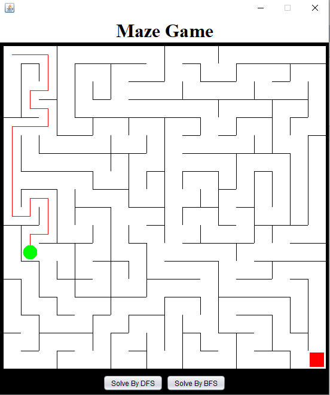
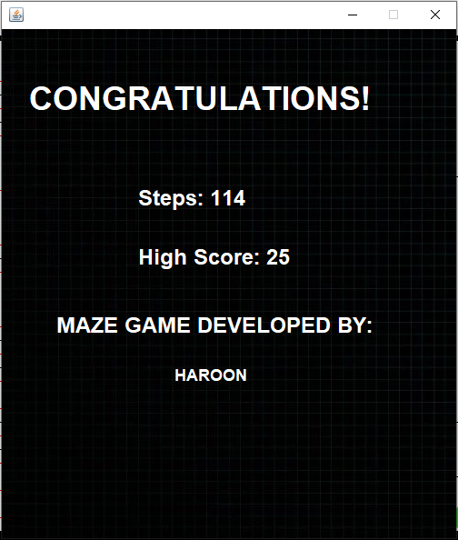

# MazeGenerator-DataStructuresAndAlgorithms

## Overview

MazeGenerator is a Java application developed as part of the Fall'22 semester project. It is capable of generating random mazes and solving them using various data structures and algorithms.

## Features

- Generates random mazes
- Solves generated mazes
- Visualization of maze generation and solving processes

## Data Structures and Algorithms Implemented

This project incorporates over 10 data structure concepts, including but not limited to:

- **Arrays**: Used for storing maze cells and states.
- **Linked Lists**: Utilized for path tracking and backtracking during maze solving.
- **Stacks**: Implemented in Depth-First Search (DFS) algorithm.
- **Queues**: Used in Breadth-First Search (BFS) algorithm.
- **Trees**: For representing and traversing the maze structure.
- **Graphs**: The maze itself is treated as a graph where cells are nodes and paths are edges.
- **Heaps**: For optimizing pathfinding algorithms.
- **Hash Maps**: To efficiently store and retrieve maze cell states.
- **Priority Queues**: Used in algorithms like Dijkstra’s for shortest path finding.
- **Recursion**: For recursive backtracking in maze generation and solving.

## Algorithms

- **Depth-First Search (DFS)**: For maze generation and solving.
- **Breadth-First Search (BFS)**: For alternative maze solving approach.
- **Dijkstra’s Algorithm**: For finding the shortest path in the maze.
- **Recursive Backtracking**: For maze generation.

## Screenshots

### Main Menu


### Gameplay


### Results


## Getting Started

### Prerequisites

- Java Development Kit (JDK) 8 or later
- Integrated Development Environment (IDE) like IntelliJ IDEA, Eclipse, or NetBeans

### Installation

1. Clone the repository:

   ```sh
   git clone https://github.com/HaroonMirza02/MazeGenerator-DSA.git
   ```

2. Open the project in your preferred IDE.

3. Build the project.

### Running the Application

1. Navigate to the main class `MazeGenerator` containing the `main` method.
2. Run the application.
3. Follow the on-screen instructions to generate and solve a maze.

## Usage

- **Generate Maze**: Choose the option to generate a new random maze.
- **Solve Maze**: Select the solving algorithm (DFS, BFS) to solve the maze or Manually with arrow keys.
- **Visualize**: Watch the maze generation and solving process.

## Contributing

Contributions are welcome! Please follow these steps:

1. Fork the repository.
2. Create a new branch (`git checkout -b feature/YourFeature`).
3. Commit your changes (`git commit -m 'Add your feature'`).
4. Push to the branch (`git push origin feature/YourFeature`).
5. Create a new Pull Request.

## License

This project is licensed under the MIT License - see the [LICENSE](LICENSE) file for details.

## Contact

- Email: haroon.mirza040602@gmail.com
- GitHub: [HaroonMirza02](https://github.com/HaroonMirza02)
